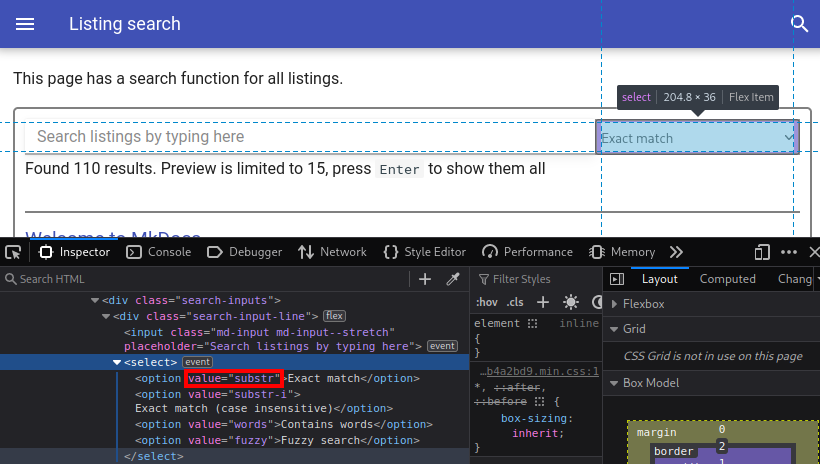

# mkdocs-search-links-plugin

A small plugin to extract all your links and put them in a single page and/or adds a page where you can search through all your links.
If you have many outgoing links this makes it easier to find them based on some words in the URL.
For example if you remember that there was a GitHub project by GhostPack but do not remember its name or page, you could search for something like the following:

- `github.com/GhostPack`
- `ghostpack`
- `/ghostpack/`
- `github ghostpack`

The search function supports different search methods (fuzzy match, substring, contains words).

## Demo

You can try out the demo at <https://mkdocs-search-links-plugin.six-two.dev>.
It is configured to offer both the search and all links pages and uses the plugin with some common MkDocs themes (mkdocs, readthedocs, and material).
The source for this demo is also in this repo (`mkdocs.yml`, `docs/` and `build.sh`).

## Setup

1. Install the plugin using pip:

    ```bash
    pip install mkdocs-search-links-plugin
    ```

2. Add the plugin to your `mkdocs.yml`:

    ```yaml
    plugins:
    - search
    - search_links
    ```

    > If you have no `plugins` entry in your config file yet, you'll likely also want to add the `search` plugin. MkDocs enables it by default if there is no `plugins` entry set.

    More information about plugins in the [MkDocs documentation](http://www.mkdocs.org/user-guide/plugins/).

3. Configure a page with all links, a page with link search, or both (see below).
4. Optional: To properly detect which language a link belongs to, you may have to add the following to your `mkdocs.yml` as described in the [Material for MkDocs page on code blocks](https://squidfunk.github.io/mkdocs-material/reference/code-blocks/):
    ```yaml
    markdown_extensions:
    - pymdownx.highlight:
        anchor_linenums: true
        line_spans: __span
        pygments_lang_class: true
    - pymdownx.inlinehilite
    - pymdownx.snippets
    - pymdownx.superfences
    ```


### Link page

Add a Markdown file for the page that will be filled with all the links.
In that file add the placeholder where the links should be inserted.
Then reference that file and specify the placeholder like this in your `mkdocs.yml`:
```yaml
plugins:
- search_links:
    listings_file: links.md
    placeholder: PLACEHOLDER_LINKS_PLUGIN
```

### Link search

#### Via mkdocs.yml

This is the simplest way and is recommended for most users:

1. Set `search_page_path` in your plugin settings to either a page path (it can already exist, but does not need to):
    ```yaml
    plugins:
    - search_links:
        search_page_path: plugin/index.md
    ```
2. If the page does not exist and should be added by the plugin, then enable `search_page_create_if_missing`:
    ```yaml
    plugins:
    - search_links:
        search_page_path: plugin/index.md
        search_page_create_if_missing: True
    ```

It the page already exists, then a new section with the search box and results will be added.
If it does not exist and should be created, then a page containing only the search box and results will be created.

#### Manual

This is more complicated to set up, but you have more control about the page:

1. Create a page, which should contain the search function.
2. Add a tag where the search elements should be inserted and load the search script:
    ```markdown
    <div id="listing-extract-search"></div>
    <script src="/listing-search.js" async></script>
    ```
3. Specify where you want the plugin to write the script file to.
This should match the path you used in the previous step.
    In `mkdocs.yml`:

    ```yaml
    plugins:
    - search_links:
        javascript_search_file: listing-search.js
    ```

I recommend using an absolute path for the `script.src` attribute, since it will keep working after moving the page or after switching between directory URLs and non directory URLs pages.
It just runs into problems when your base directory (where the page is deployed) is not the root directory or when you are using offline mode (from `file://` URLs).

Alternatively you can include the script and the data inline, but this can have tiny performance drawbacks:

- If you include it on multiple pages, all of them will contain a copy of the data -> reduces caching efficiency
- The whole search database needs to be downloaded while your page is loading (can not use `async` or `defer` script attributes).

## Configuration

You can configure the plugin like this:
```yaml
plugins:
- search_links:
    listings_file: listings.md
    placeholder: PLACEHOLDER_LISTINGS_PLUGIN
    javascript_search_file: listing-search.js
    default_css: true
    offline: false
    default_search_mode: substr-i
    search_page_path: ""
    search_page_create_if_missing: false
    search_page_section_name: Code Snippet Search

```

### default_css

`default_css` determines, whether the search JavaScript should also load the default styling for the search dialog and results.
By default it is set to `true`, but you can set it to `false` if the theme you use does not work well with the style.
You should then define your own custom style and include it on the search page.
Also has some effect on the all listings page.

### listings_file

`listings_file` is expected to contain the relative path to the Markdown file, where the listings should be written to.
If the file does not exist, an error will be raised during the build process.
The default value is empty.

### placeholder

The value for `placeholder` will be searched in the file referenced by `listings_file` and be replaced with the list of all listings.

### javascript_search_file

The JavaScript code for the search function will be written to this path.
The default value is empty, meaning that neither the JSON file nor the JavaScript are generated.

### offline

When set to `true` the listing data is included into the JavaScript file.
This way it can be used even when the site if opened from the file system (via a `file://` URL).
The disadvantage is that the loading of the script will take longer and the data is not loaded asynchronously, so the loading of the page via the Internet will be delayed.
Because of that it is set to `false` by default.

### default_search_mode

The default search mode to use for all search pages.
This can be overwritten by the `data-searchmode` as shown below for individual search boxes.

### search_page_path

Insert a search box and results on this page.
This allows you to use the plugin without needing to modify the Markdown files in your `docs` directory.

### search_page_create_if_missing

If the page specified by `search_page_path` does not exist, then create it and add it to the navigation.

### search_page_section_name

The name of the section (if page exists) or the page title (if the page was newly created) that will be added to the page specified by `search_page_path`.

### Search mode

You can set the search mode via the `data-searchmode` attribute:
```html
<div id="listing-extract-search" data-searchmode="substr"></div>
```

To see all current valid values inspect the search type dropdown menu using your browser's developer tools.
The data in the `value` attribute is the value you should put in the attribute:



Alternatively you can put in a random value and will receive an warning message in the developer tools, that also lists the valid values (but without descriptions).


## Changelog


### Version 0.1.0

- Initial version based on [mkdocs-extract-listings-plugin](https://github.com/six-two/mkdocs-extract-listings-plugin) v0.2.1
